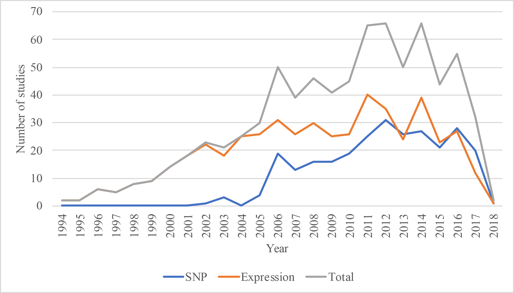
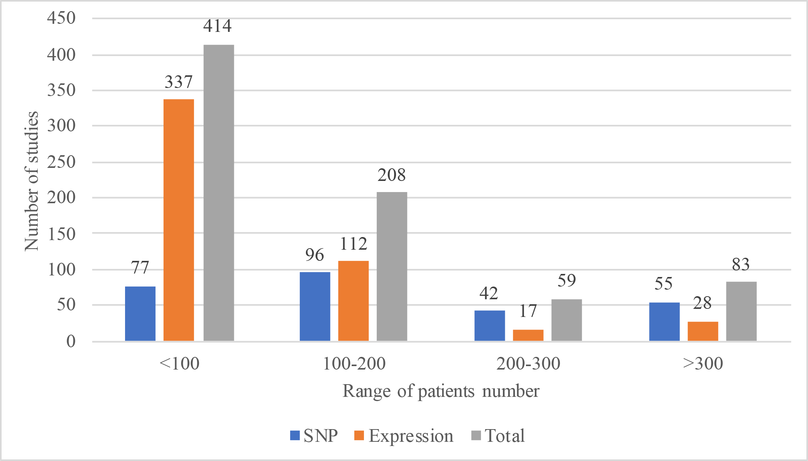
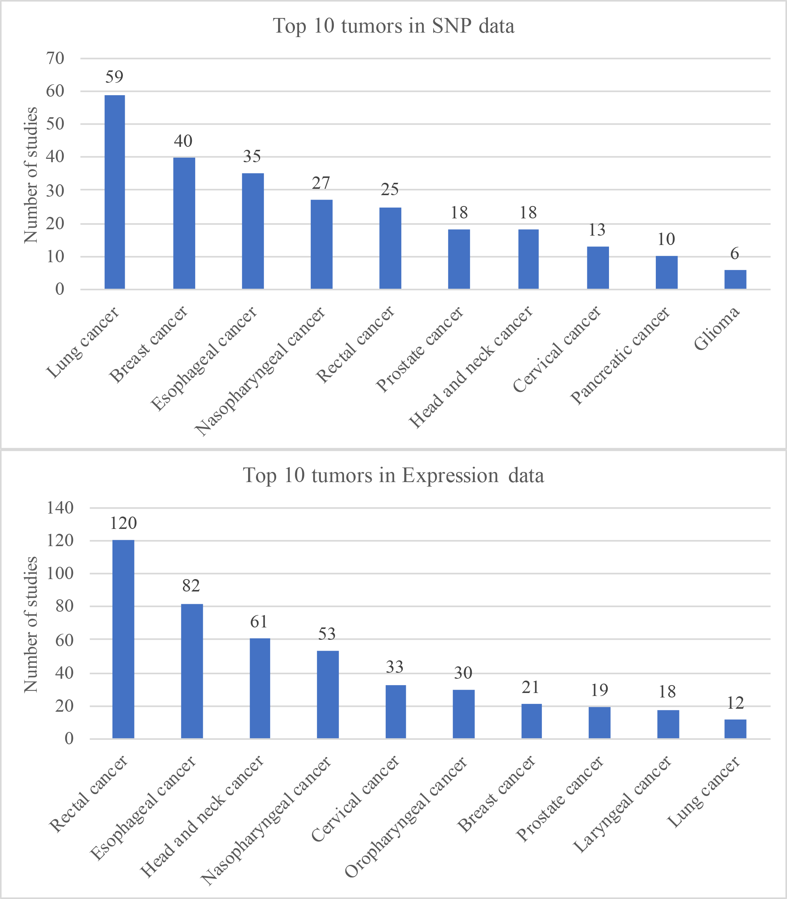
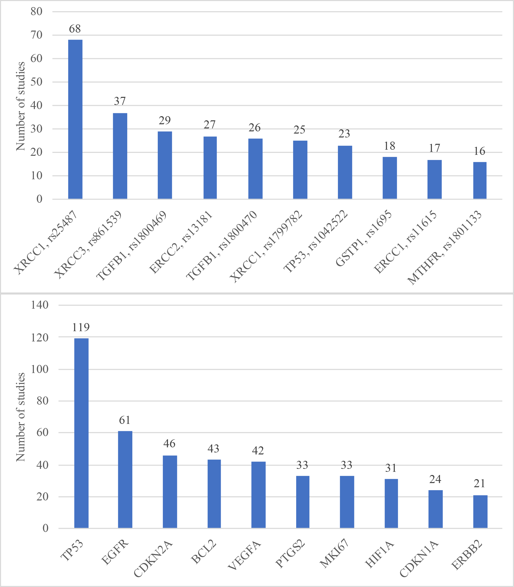
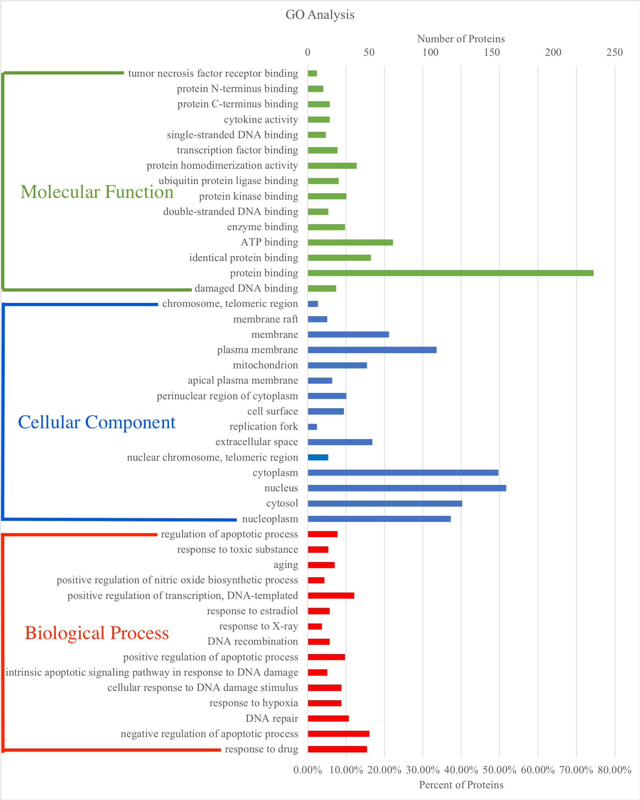
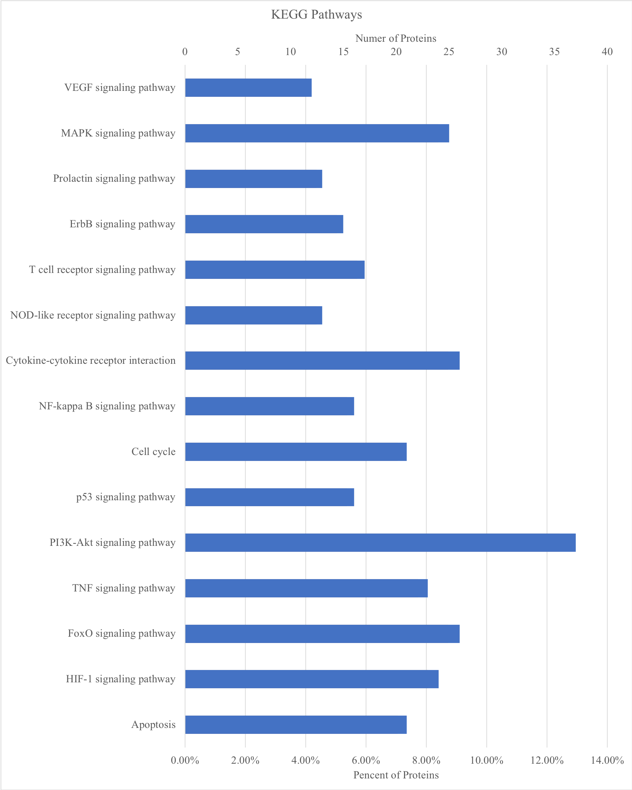

# Radiation Genomics Knowledgebase

Visit: [www.radiogkb.com](http://www.radiogkb.com/)
Contact: [trpkb2017@163.com](mailto:trpkb2017@163.com)

## About Knowledgebase

The RTPDB (Radiotherapy Prognosis Database) is a tumor prognosis resource that focus on the relationship between human genetic variation or gene expression and prognosis of patients who received radiotherapy with or without other treatments. RTPDB collects, curates and disseminates data about the impact of human genetic variation on prognosis of cancer patients. Now, we mainly focus on the association between single nucleotide polymorphism (SNP) or gene expression and prognosis. Mutations in other type will be included in turn.

**Figure 1. The distribution of studies included in the database from 1994 to 2018** 

**Table 1. The language of included studies**

| Language | SNP (%)      | Expression (%) | Total (%)     |
| :-------- | :-------------- | :---- | :----- |
| Chinese  | 45 (16.67%)  | 53 (10.72%)    | 98 (12.83%)   |
| English  | 225 (83.33%) | 440 (89.07%)   | 665 (87.04%)  |
| Korean   | 0 (0.00%)    | 1 (0.21%)      | 1 (0.13%)     |
| Total    | 270 (35.33%) | 494 (64.67)    | 764 (100.00%) |

**Table 2. The publication type of included studies**

| Publication type      | SNP (%)      | Expression (%) | Total (%)     |
| :-------------------- | :----------- | :------------- | :------------ |
| Journal               | 260 (96.30%) | 473 (95.75%)   | 733 (95.54%)  |
| Doctoral Dissertation | 5 (1.85%)    | 13 (2.63%)     | 18 (2.36%)    |
| Masters' Thesis       | 4 (1.48%)    | 8 (1.62%)      | 12 (1.57%)    |
| Proceeding            | 1 (0.37%)    | 0 (0.00%)      | 0 (0.13%)     |
| Total                 | 270 (35.33%) | 494 (64.67)    | 764 (100.00%) |

**Figure 2. The range of patients’ number in included studies**

**Figure 3. Top 10 tumors in SNP and Expression data**

**Figure 4. Top 10 variant and gene in SNP and Expression data**

**Table 3. The treatment type in SNP data**

| Treatment type        | Meaning      | Number of studies (%) |
| :-------------------- | :----------- | :-------------------- |
| Radiotherapy ± Chemotherapy | All patients received radiotherapy, and partial patients received chemotherapy. | 62 (22.96%) |
| Radiotherapy + Chemotherapy | All patients received radiotherapy and chemotherapy. | 44 (16.30%) |
| Radiotherapy | All patients received radiotherapy. | 44 (16.30%) |
| Radiotherapy + Chemotherapy + Surgery | All patients received radiotherapy, chemotherapy and surgery. | 34 (12.59%) |
| Radiotherapy ± Chemotherapy ± Surgery | All patients received radiotherapy, and partial patients received chemotherapy and surgery. | 18 (6.67%) |
| Radiotherapy + Surgery | All patients received radiotherapy and surgery. | 18 (6.67%) |
| Radiotherapy + Chemotherapy ± Surgery | All patients received radiotherapy and chemotherapy, and partial patients received surgery. | 16 (5.93%) |
| Radiotherapy ± Hormone therapy | All patients received radiotherapy, and partial patients received hormone therapy. | 8 (2.96%) |
| Radiotherapy ± Chemotherapy + Surgery | All patients received radiotherapy and surgery, and partial patients received chemotherapy. | 8 (2.96%) |
| Radiotherapy ± Chemotherapy ± Hormone therapy + Surgery | All patients received radiotherapy and surgery, and partial patients received chemotherapy and hormone therapy. | 6 (2.22%) |
| Radiotherapy ± Hormone therapy ± Surgery | All patients received radiotherapy, and partial patients received hormone therapy and surgery. | 5 (1.85%) |
| Radiotherapy ± Hormone therapy + Surgery | All patients received radiotherapy and surgery, and partial patients received hormone therapy. | 2 (0.74%) |
| Radiotherapy ± Chemotherapy ± Hormone therapy | All patients received radiotherapy, and partial patients received chemotherapy and hormone therapy. | 2 (0.74%) |
| Radiotherapy + Chemotherapy + Hormone therapy | All patients received radiotherapy, chemotherapy and hormone therapy. | 1 (0.37%) |
| Radiotherapy ± Surgery | All patients received radiotherapy, and partial patients received surgery. | 1 (0.37%) |
| Radiotherapy ± Chemotherapy ± Hormone therapy ± Surgery | All patients received radiotherapy, and partial patients received chemotherapy, hormone therapy and surgery. | 1 (0.37%) |

**Table 4. The treatment type in Expression data**

| Treatment type        | Meaning      | Number of studies (%) |
| :-------------------- | :----------- | :-------------------- |
| Radiotherapy + Chemotherapy + Surgery | All patients received radiotherapy, chemotherapy and surgery. | 130 (26.96%) |
| Radiotherapy | All patients received radiotherapy. | 90 (18.22%) |
| Radiotherapy + Chemotherapy | All patients received radiotherapy and chemotherapy. | 89 (18.02%) |
| Radiotherapy ± Chemotherapy | All patients received radiotherapy, and partial patients received chemotherapy. | 66 (13.36%) |
| Radiotherapy + Surgery | All patients received radiotherapy and surgery. | 49 (9.92%) |
| Radiotherapy + Chemotherapy ± Surgery | All patients received radiotherapy and chemotherapy, and partial patients received surgery. | 23 (4.66%) |
| Radiotherapy ± Chemotherapy ± Surgery | All patients received radiotherapy, and partial patients received chemotherapy and surgery. | 13 (2.6%) |
| Radiotherapy ± Chemotherapy + Surgery | All patients received radiotherapy and surgery, and partial patients received chemotherapy. | 11 (2.23%) |
| Radiotherapy ± Hormone therapy | All patients received radiotherapy, and partial patients received hormone therapy. | 7 (1.42%) |
| Radiotherapy ± Surgery | All patients received radiotherapy, and partial patients received surgery. | 5 (1.01%) |
| Radiotherapy + Hormone therapy | All patients received radiotherapy and hormone therapy. | 5 (1.01%) |
| Radiotherapy ± Chemotherapy ± Hormone therapy + Surgery | All patients received radiotherapy and surgery, and partial patients received chemotherapy and hormone therapy. | 2 (0.40%) |
| Radiotherapy + Chemotherapy ± Hormone therapy + Surgery | All patients received radiotherapy, chemotherapy and surgery, and partial patients received hormone therapy. | 2 (0.40%) |
| Radiotherapy ± Chemotherapy ± Hormone therapy ± Surgery | All patients received radiotherapy, and partial patients received chemotherapy, hormone therapy and surgery. | 1 (0.20%) |
| Radiotherapy ± Chemotherapy ± Hormone therapy | All patients received radiotherapy, and partial patients received chemotherapy and hormone therapy. | 1 (0.20%) |

**Figure 5. GO analysis of gene which is significantly associated with radiotherapy prognosis**

**Figure 6. KEGG pathways of gene which is significantly associated with radiotherapy prognosis**