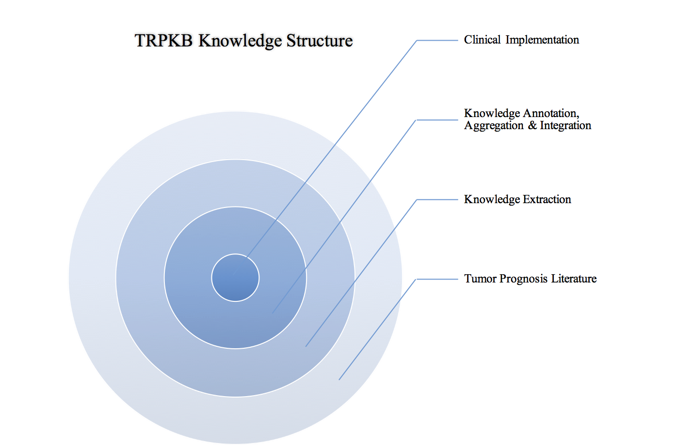
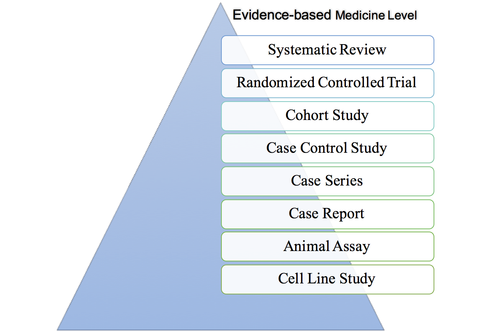
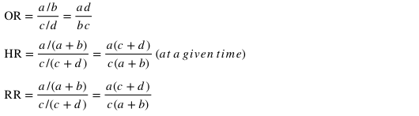

# Radiation Genomics Knowledgebase

Visit: [www.radiogkb.com](http://www.radiogkb.com/)

Contact: [trpkb2017@163.com](mailto:trpkb2017@163.com)

## About Knowledgebase

The RadioGKB (Radiation Genomics Knowledgebase) is a tumor knowledge resource that focus on the relationship between human genetic variation or gene expression and prognosis of patients who received radiotherapy with or without other treatments. RadioGKB collects, curates and disseminates knowledge about the impact of human genetic variation on prognosis of cancer patients. Now, we mainly focus on the association between single nucleotide polymorphism (SNP) or gene expression and prognosis. Mutations in other type will be included in turn.

**Figure 1. The RadioGKB Structure**  

Figure 1 The RadioGKB Knowledge Structure Providing users with a visualization of the different types of information found in knowledgebase, and how this knowledge is acquired and integrated together – from the data of variation and prognosis at the outside of the circle to implementation of genetic variation in the clinic at th e central. Each step is described briefly below.

### Tumor Prognosis Literature

The tumor prognosis literature, such as publications found in PubMed and published by researchers and clinicians forms the outside of the RadioGKB knowledge structure. From here, we include literature according to inclusion criteria. For every study included in the RadioGKB, we classify them by Evidence-based Medicine Level from [iCMDB knowledgebase ](http://www.vishuo.com/cn/icmdb/).

***Figure 2. Evidence-based Medicine Level***

### Knowledge Extraction

We extract some clinical information, such as patient number, sex ratio, age, genetic variation, treatment, prognosis and statistical results from the publication.

### Knowledge Annotation, Aggregation & Integration

We replace name of gene and variation with official name. At the same time, we collect the primary information of gene and variation. Then we summary up the treatment in clinical terms.

### Clinical Implementation

Base on the statistical result, we would know whether the genetic variation or gene expression could influence the prognosis with specific treatment.

## About Knowledge

We focus on the association between single nucleotide polymorphism (SNP) and prognosis of cancer patients who received radiotherapy with or without other treatments. As we know, most SNP in human genome has two alleles: ancestral allele and minor allele. So, there are three genotypes in this specific position: wild homozygous type, mutant heterozygous type and mutant homozygous type.

In clinical cohort study, we need to know whether exposure group influences the study endpoint when compared with un-exposure group under specific circumstance. In our knowledgebase, the exposure group often means wild homozygous type, and the un-exposure group often means mutant heterozygous type and mutant homozygous type or mutant heterozygous/homozygous type. For endpoint, it stands for specific event of prognosis. For example, most research use death as the endpoint in overall survival (OS).

OR (odds ratio), HR (hazard ratio) and RR (relative risk/risk ratio) are extracted from publications to show the association between SNP and prognosis. Some articles do not offer OR sometimes, OR need to be calculated by using STATA 14.1 (StataCorp. 2015. Stata Statistical Software: Release 14. College Station, TX: StataCorp LP.) with original data.

***Table 1. Four-fold table***

| Group       | Event | Non-event | Total |
| :---------- | :---- | :-------- | :---- |
| Exposure    | a     | b         | a+b   |
| Un-exposure | c     | d         | c+d   |
| Total       | a+c   | b+d       |       |

OR often be used in case-control study or prospective study. HR often been used clinical medicine research or cohort study of Epidemiology. Hazard is an instantons rate of a given outcome, which include time factor. HR is a ratio of two hazards (Exposure/Un-exposure) at that given time. RR often be used in cohort study or randomized controlled trial.

If both OR/HR/RR and low value of 95% confidence interval (95% CI) > 1, the patients in exposure group has high risk to reach the endpoint compared with un-exposure group. On the contrary, the patients in exposure group has low risk to reach the endpoint. To be more accurate, we consider P value > 0.05 as significance level.

In the result page, we use table to present the association between SNP and prognosis. Table 2 shows the association between XRCC1 rs25487 and ≥2 radiation pneumonitis in patients after treatment for non-small cell lung cancer.

***Table 2. The association between XRCC1 rs25487 and ≥2 radiation pneumonitis in patients after treatment for non-small cell lung cancer***

| Genotypes | No. of patients | Event | HR (U) | 95%CI (U) | P (U) | HR (M) | 95%CI (M) | P (M) |
| :-------- | :-------------- | :---- | :----- | :-------- | :---- | :----- | :-------- | :---- |
| GG | 49 | 25 | 1.00 |  |  | 1.00 |  |  |
| AG | 72 | 28 | 0.73 | 0.42-1.25 | 0.248 | 0.76 | 0.44-1.31 | 0.322 |
| AA | 44 | 13 | 0.52 | 0.26-1.01 | 0.054 | 0.48 | 0.24-0.97 | 0.041 |
| AG/AA | 116 | 41 | 0.64 | 0.39-1.06 | 0.081 | 0.65 | 0.39-1.09 | 0.100 |

*HR: hazard ratio; 95% CI: 95% confidence interval; U: univariate analysis; M: multivariate analysis, it means the HR was adjusted for some clinical factors. Event: ≥2 radiation pneumonitis.*

The data in table 2 comes from the article below.

> *Yin M, Liao Z, Liu Z, et al. Functional polymorphisms of base excision repair genes XRCC1 and APEX1 predict risk of radiation pneumonitis in patients with non–small cell lung cancer treated with definitive radiation therapy[J]. International Journal of Radiation Oncology* Biology* Physics, 2011, 81(3): e67-e73.*
>